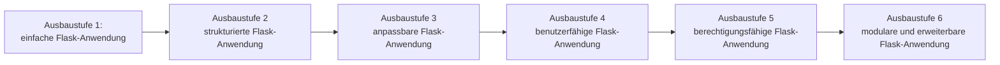

# Flask Learning Template

Ein schrittweiser Lernpfad und eine Sammlung direkt nutzbarer Flask-Templates. von einer einfachen Flask-Webanwendung bis hin zu einer modularen und erweiterbaren Webanwendung.

## Ziel

Dieses Projekt soll Flask nicht anhand einzelner, voneinander unabhängiger Beispiele vermitteln, sondern anhand der **schrittweisen Entwicklung einer vollständigen Web-Anwendung.**

Die Anwendung beginnt bewusst einfach und wird mit jeder Ausbaustufe um neue Konzepte und Funktionen erweitert.

Dabei verfolgt das Projekt **zwei Ziele**:

1. **Flask lernen** -> durch einen klaren linearen Lernpfad.
2. **Eine nutzbare Grundlage schaffen** -> jede Ausbaustufe stellt eine vollständige und funktionsfähige Anwendung dar, die als Ausgangspunkt für ein eigenes Projekt verwendet werden kann.

Der Lernpfad zeigt dabei nicht nur, **wie einzelne Flask-Funktionen verwendet werden**, sondern auch, **wie sich die Architektur einer Anwendung mit zunehmender Komplexität weiterentwickelt**.

## Die sechs Ausbaustufen

Das Projekt besteht aus sechs aufeinander aufbauenden Ausbaustufen:

| Ausbaustufe | Thema | Inhalt |
| --------- | --------- | --------- |
| 1 | Flask-Grundlagen | Flask-Anwendung starten, Seite aufbauen |
| 2 | Sprachumschaltung | Seite in mehreren Sprachen anzeigen |
| 3 | benutzerdefinierte Darstellung | Seite in unterschiedlichen Farben anzeigen |
| 4 | Authentifizierung | Registrierung, Login, Logout |
| 5 | Autorisierung | Rollen, Gruppen, Berechtigungen und Zugriffskontrolle |
| 6 | Modulare Architektur | Module, Add-ons und Plugin-Architektur |

Diese Ausbaustufen sind für den Lernpfad **bewusst linear und kumulativ aufgebaut**.

Jede Ausbaustufe baut auf einer vorherigen auf und lässt sich vereinfacht so darstellen:

Das Ziel ist daher nicht sechs voneinander unabhängige Beispiele bereitzustellen.

Stattdessen soll nachvollziehbar werden, **wie sich eine reale Flask-Anwendung Schritt für Schritt weiterentwickeln lässt**.

## Aufbau des Repos

/ 
├── app/ 
│&emsp;&ensp;└── ... # Anwendungscode 
│ 
├── docs/ 
│&emsp;&ensp;├── application/ 
│&emsp;&ensp;│&emsp;&ensp;├── level_1_basics.md 
│&emsp;&ensp;│&emsp;&ensp;├── level_1_basics.ipynb 
│&emsp;&ensp;│&emsp;&ensp;└── ... # weitere Level 
│&emsp;&ensp;└── 0_preparation.md 
│ 
├── README.md 
├── LICENSE 
└── ... 

### /app
Im Verzeichnis app/ befindet sich der tatsächliche Flask-Anwendungscode.

Mit jeder Ausbaustufe entwickelt sich dieser Code weiter.

Jede Ausbaustufe stellt dabei einen **vollständigen und lauffähigen Zustand der Anwendung** dar.

### /docs
Im Verzeichnis docs/ befindet sich die Dokumentation.

Für jede Ausbaustufe gibt es grundsätzlich zwei Bestandteile:

**Markdown-Datei - Theorie und Erklärung**
**Jupyter Notebook - Praxis und Code**

## Verwendung

Das Repository kann auf zwei Arten verwendet werden.

### Als Lernpfad

Wenn du Flask lernen möchtest, schaust du dir den linearen Aufbau der Stufen nacheinander durch:

Level 1 -> Level 2 -> Level 3 -> Level 4 -> Level 5 -> Level 6

Dabei kannst du zunächst die Markdown-Dokumentation lesen und anschließend die App starten oder mit dem Code etwas experimentieren.

### Als Anwendungsvorlage

Jede abgeschlossene Ausbaustufe kann außerdem als Ausgangspunkt für ein eigenes Flask-Projekt verwendet werden.

Du kannst bspw. einen bestimmten Stand auschecken und anschließend auf dieser Grundlage deine eigene Anwendung entwickeln.

Damit verbindet das Projekt:

**Lernmaterial + vollständige Anwendung + wiederverwendbare Vorlage**

## Grundprinzipien

Das Projekt folgt einigen grundlegenden Prinzipien:
- **Lernen durch Bauen** - neue Konzepte werden anhand einer funktionierenden Anwendung vermittelt.
- **Linearer Lernpfad** - jede Ausbaustufe baut auf den vorherigen auf.
- **Kumulativer Aufbau** - bereits eingeführte Konzepte bleiben Bestandteil der Anwendung.
- **Jede Ausbaustufe ist nutzbar** - jeder Stand stellt eine vollständige Anwendung dar.
- **Theorie und Praxis getrennt** - Erklärungen befinden sich in Markdown-Dateien, praktische Beispiele in Jupyter Notebooks.
- **Anwendungscode bleibt zentral** - der Anwendungscode befindet sich unter /app .
- **Komplexität wird schrittweise eingeführt** - neue Konzepte werden erst dann eingeführt, wenn sie für den nächsten Entwicklungsschritt relevant sind.
- **Erweiterbarkeit als Ziel** - die letzte Ausbaustufe zeigt den Übergang von einer einzelnen Anwendung zu einer modularen Plattform.

Das Projekt soll kein universelles Flask-Framework und kein "Framework mit allem" sein.

Es soll einen **klaren und nachvollziehbaren Weg von einer einfachen Flask-Anwendung zu einer strukturierten, sicheren und erweiterbaren Webanwendung zeigen.

## Dokumentation

Wie bereits erwähnt befindet sich die Dokumentation im Verzeichnis docs/ .

Die Markdown-Datei erklärt bspw.:
- Was wird in dieser Ausbaustufe eingeführt?
- Warum wird es benötigt?
- Welche Konzepte werden vermittelt?
- Wie verändert sich die Architektur?
- Welche wichtigen Entscheidungen wurden getroffen?

Das Jupyter Notebook enthält bspw.:
- Codebeispiele
- ausführbare Code-Zeilen
- Erklärungen zum Code
- Beispiele für die eingeführten Konzepte

Damit bilden beide Dateien eine Einheit:

- **level_*.md** -> erklärt **WAS** und **WARUM**
- **level_*.ipynb** -> zeigt **WIE**
- **/app** -> enthält den vollständigen Stand der Ausbaustufe

Der Einstieg erfolgt 0 - Preparation.

Anschließend werden die sechs Ausbaustufen in der vorgesehenen Reihenfolge bearbeitet.

## Lizenz

Dieses Projekt steht unter der **MIT License**.

Du darfst den Code frei verwenden, verändern, kopieren und weitergeben - auch für kommerzielle Projekte, sofern die Bedingungen der Lizenz eingehalten werden. **Have fun!**
